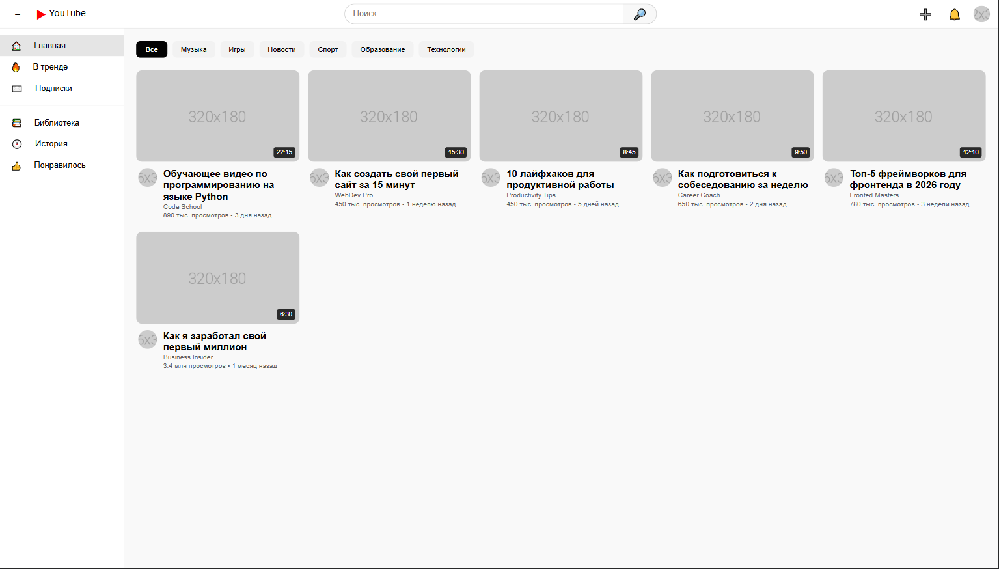
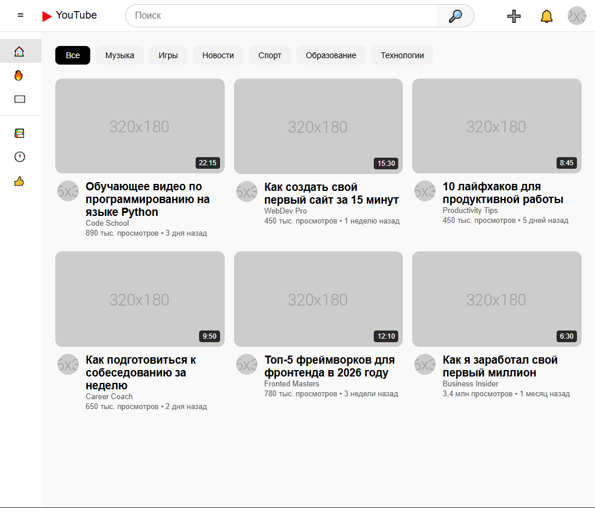
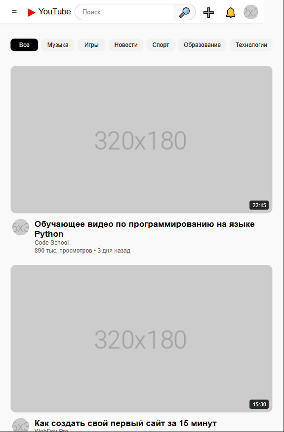

# YouTube Clone - Лабораторная работа №9-10
**Студент:** Зламанюк А.А.
**Группа:** ИСП-231
---
## Описание

Это адаптивный клон главной страницы YouTube, созданный в рамках лабораторной работы. Проект демонстрирует продвинутые техники вёрстки с использованием Flexbox и CSS Grid для создания сложных макетов, включая боковую панель, блок категорий ("чипсы") и сетку карточек видео.

---
## Реализованные функции
- [ ] Адаптивный хедер с поиском
- [ ] Боковая панель навигации
- [ ] Категории (чипсы) с интерактивностью и горизонтальной прокруткой
- [ ] Детальная стилизация карточки видео (превью, длительность, аватар, заголовок, мета-информация)
- [ ] Сетка видео на CSS Grid с автоматическим перестроением колонок
- [ ] Hover-эффекты на карточках (поднятие, тень, масштабирование изображения)
- [ ] Полная адаптивность под все устройства (десктоп, планшеты, мобильные) с помощью медиа-запросов
---
## Технологии
- HTML5
- CSS3
- Flexbox
- CSS Grid
- Media Queries
---
## Скриншоты
### Desktop (1920px)

### Tablet (1024px)

### Mobile (375px)

---
## Как запустить
1. Откройте файл `index.html` в браузере
2. Или используйте **Live Server** в VS Code:
- Установите расширение Live Server
- Правой кнопкой по `index.html` → Open with Live Server
---
## Структура проекта

Корневая папка проекта содержит файл `index.html` и папку `style.css`. Основные элементы страницы организованы с помощью семантических тегов: `<header>`, `<aside>` (боковая панель), `<main>` (основной контент). В папке `img` хранятся изображения для превью, аватарки и скриншоты этапов работы.

---
## Вывод

В ходе выполнения лабораторной работы я углубил навыки создания сложных веб-интерфейсов. Были изучены и применены на практике техники создания сеток с помощью CSS Grid, стилизация интерактивных элементов (чипсы, карточки) и создание плавных анимаций при наведении. Отдельное внимание было уделено адаптивности: от десктопной версии до мобильных устройств с использованием медиа-запросов. Проект помог систематизировать знания по современной вёрстке.

---
## Дата выполнения
25.02.2026